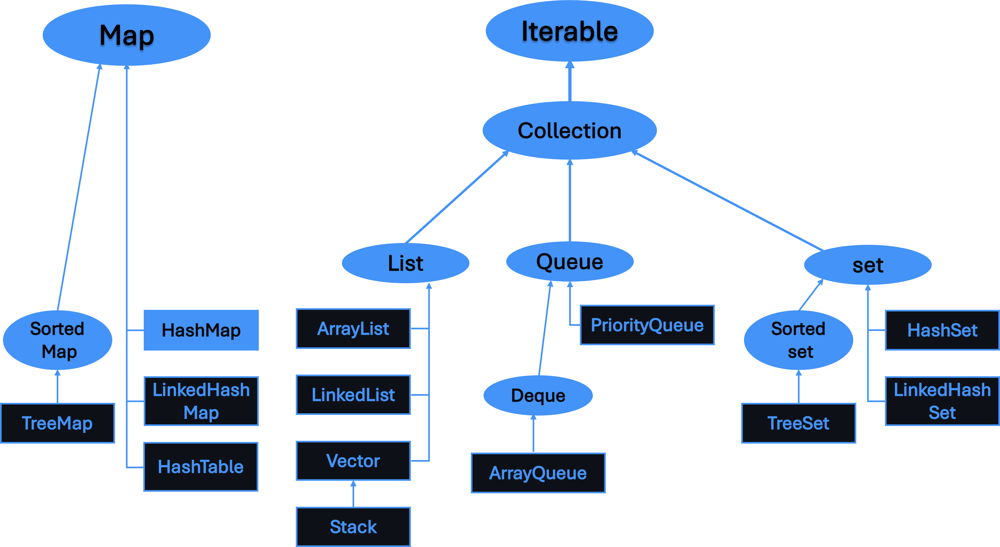

# java.util Package

Welcome to the **`Activate JetBrains Mono Font pack`** folder of the **Mastering Java Core and Utilities** repository! This section covers the `java.util` package, which is one of the most essential parts of the Java Standard Library. The `java.util` package provides a wide range of utility classes, including the Collections Framework, event model, date and time utilities, and more.

## Table of Contents

1. [Introduction](#introduction)
2. [Collections Framework](#collections-framework)
   - [List Interface](#list-interface)
   - [Set Interface](#set-interface)
   - [Map Interface](#map-interface)
   - [Queue Interface](#queue-interface)
3. [Date and Time Utilities](#date-and-time-utilities)
4. [Concurrency Utilities](#concurrency-utilities)
5. [Other Utilities](#other-utilities)
6. [How to Use](#how-to-use)
7. [Contributing](#contributing)
8. [License](#license)

## Introduction

The `java.util` package is a treasure trove of utility classes that make Java development easier and more efficient. It includes the Collections Framework, which provides a set of interfaces and classes for working with groups of objects, as well as utilities for handling dates, random numbers, concurrency, and more.

```swift
java.util
│
├── Interfaces
│   │
│   ├── Collection<E>                    // Root interface for the collections framework
│   │   ├── List<E>                      // Ordered collection (sequence)
│   │   │   ├── AbstractList<E>     
│   │   │   ├── ArrayList<E>
│   │   │   ├── LinkedList<E>
│   │   │   ├── Vector<E>
│   │   │   │   └── Stack<E>             // LIFO stack, a subclass of Vector
│   │   ├── Set<E>                       // Collection that contains no duplicate elements
│   │   │   ├── AbstractSet<E>
│   │   │   ├── HashSet<E>
│   │   │   ├── LinkedHashSet<E>
│   │   │   └── SortedSet<E>             // Set that maintains its elements in ascending order
│   │   │       └── NavigableSet<E>
│   │   │           └── TreeSet<E>       // Red-Black tree-based implementation of NavigableSet
│   │   ├── Queue<E>                     // Collection designed for holding elements prior to processing
│   │   │   ├── Deque<E>                 // Double-ended queue
│   │   │   │   ├── ArrayDeque<E>
│   │   │   │   └── LinkedList<E>        // Implements Deque
│   │   │   ├── PriorityQueue<E>         // Priority heap-based queue
│   │   ├── Map<K, V>                    // Collection that maps keys to values
│   │   │   ├── AbstractMap<K, V>
│   │   │   ├── HashMap<K, V>
│   │   │   │   └── LinkedHashMap<K, V>  // Linked version of HashMap
│   │   │   ├── Hashtable<K, V>
│   │   │   ├── SortedMap<K, V>          // Map that maintains its mappings in ascending key order
│   │   │   │   └── NavigableMap<K, V>
│   │   │   │       └── TreeMap<K, V>    // Red-Black tree-based implementation of NavigableMap
│   │   │   ├── WeakHashMap<K, V>        // Weak keys for garbage collection
│   │   │   ├── IdentityHashMap<K, V>    // Uses reference-equality in place of object-equality
│   │   │   ├── EnumMap<K extends Enum<K>, V> // Map with enum keys
│   │   │   └── ConcurrentMap<K, V>      // Concurrent version of Map
│   │   │       ├── ConcurrentHashMap<K, V>
│   │   │       └── ConcurrentSkipListMap<K, V>
│   │   ├── Iterator<E>                  // Iterator over a collection
│   │   ├── ListIterator<E>              // Iterator for lists
│   │   ├── Spliterator<T>               // Spliterator for parallel processing
│   │   ├── Comparator<T>                // Comparator for ordering
│   │   ├── RandomAccess                 // Marker interface for fast random access
│   │   ├── Observer                     // Observer pattern interface
│   │   └── Enumeration<E>               // Older iterator interface
│
├── Classes
│   │
│   ├── AbstractCollection<E>
│   ├── AbstractList<E>
│   ├── AbstractQueue<E>
│   ├── AbstractSequentialList<E>
│   ├── AbstractSet<E>
│   ├── ArrayList<E>
│   ├── Arrays                           // Utility class for array manipulation
│   ├── BitSet                           // A set of bits
│   ├── Calendar                         // Abstract class for date manipulation
│   │   └── GregorianCalendar            // Concrete implementation of Calendar
│   ├── Collections                      // Utility class for collection operations
│   ├── Currency                         // Represents a currency
│   ├── Date                             // Date and time representation
│   ├── Dictionary<K, V>                 // Legacy class, a collection of key-value pairs
│   ├── EnumSet<E extends Enum<E>>       // Set implementation for enums
│   ├── EventObject                      // Root class for all event objects
│   ├── Formatter                        // Format strings
│   ├── HashMap<K, V>                    // Hash table-based implementation of Map
│   ├── HashSet<E>                       // Hash table-based implementation of Set
│   ├── Hashtable<K, V>                  // Synchronized implementation of Map
│   ├── IdentityHashMap<K, V>            // Map with reference-equality keys
│   ├── LinkedHashMap<K, V>              // HashMap with predictable iteration order
│   ├── LinkedHashSet<E>                 // HashSet with predictable iteration order
│   ├── LinkedList<E>                    // Doubly-linked list implementation
│   ├── Locale                           // Represents a specific geographical, political, or cultural region
│   ├── Objects                          // Utility class for object operations
│   ├── Optional<T>                      // Container object which may or may not contain a value
│   ├── PriorityQueue<E>                 // Priority heap-based queue
│   ├── Properties                       // Persistent set of properties
│   ├── Random                           // Random number generator
│   ├── Scanner                          // Simple text scanner
│   ├── ServiceLoader<S>                 // Service-provider loading facility
│   ├── SplittableRandom                 // Random number generator for parallel streams
│   ├── Stack<E>                         // LIFO stack, a subclass of Vector
│   ├── StringJoiner                     // Constructs a sequence of characters
│   ├── StringTokenizer                  // Tokenizes strings
│   ├── Timer                            // Facility for threads to schedule tasks
│   ├── TimerTask                        // Task that can be scheduled
│   ├── TreeMap<K, V>                    // Red-Black tree-based implementation of NavigableMap
│   ├── TreeSet<E>                       // Red-Black tree-based implementation of NavigableSet
│   ├── UUID                             // Universally unique identifier
│   ├── Vector<E>                        // Growable array of objects
│   ├── WeakHashMap<K, V>                // HashMap with weak keys
│   ├── Properties                       // A persistent set of properties
│   ├── SimpleTimeZone                   // Concrete subclass of TimeZone
│   └── TimeZone                         // Time zone handling
│
├── Enums
│   │
│   ├── Currency                         // Enum representing currencies
│   ├── FormattableFlags                 // Flags to control formatting
│   ├── Locale.Category                  // Category to select the locale
│   └── Map.Entry<K, V>                  // Represents a key-value pair in Map
│
└── Sub-packages
    │
    ├── java.util.concurrent
    │   ├── Interfaces
    │   │   ├── Callable<V>              // Task that returns a result
    │   │   ├── Executor                 // Executes submitted Runnable tasks
    │   │   ├── ExecutorService          // Executor with lifecycle management
    │   │   ├── ScheduledExecutorService // ExecutorService supporting delayed and periodic tasks
    │   │   └── Future<V>                // Result of an asynchronous computation
    │   ├── Classes
    │   │   ├── AbstractExecutorService  // Abstract class for ExecutorService
    │   │   ├── ArrayBlockingQueue<E>    // Blocking queue backed by an array
    │   │   ├── ConcurrentHashMap<K, V>  // Concurrent Map implementation
    │   │   ├── ConcurrentLinkedQueue<E> // Concurrent linked queue
    │   │   ├── ConcurrentSkipListMap<K, V> // Concurrent Map supporting navigable operations
    │   │   ├── CopyOnWriteArrayList<E>  // List where all mutative operations are atomic
    │   │   ├── CopyOnWriteArraySet<E>   // Set where all mutative operations are atomic
    │   │   ├── CountDownLatch           // Synchronization aid
    │   │   ├── CyclicBarrier            // Synchronization barrier
    │   │   ├── ForkJoinPool             // Executor service for running ForkJoinTasks
    │   │   ├── LinkedBlockingQueue<E>   // Blocking queue backed by linked nodes
    │   │   ├── LinkedBlockingDeque<E>   // Deque with linked nodes
    │   │   ├── ScheduledThreadPoolExecutor // Thread pool with scheduled tasks
    │   │   ├── Semaphore                // Counting semaphore
    │   │   ├── SynchronousQueue<E>      // Queue that hands off elements from producer to consumer
    │   │   ├── ThreadPoolExecutor       // Executor service implementing a thread pool
    │   │   └── TimeUnit                 // Time units like SECONDS, MINUTES
    │
    ├── java.util.function
    │   ├── Interfaces
    │   │   ├── BiConsumer<T, U>         // Represents an operation with two input arguments
    │   │   ├── BiFunction<T, U, R>      // Function that takes two arguments and returns a result
    │   │   ├── BinaryOperator<T>        // Binary operation on two operands
    │   │   ├── BiPredicate<T, U>        // Predicate that takes two arguments
    │   │   ├── Consumer<T>              // Represents an operation that accepts a single input
    │   │   ├── DoubleBinaryOperator     // Binary operation on two double operands
    │   │   ├── DoubleConsumer           // Operation that accepts a single double input
    │   │   ├── DoubleFunction<R>        // Function that takes a double and returns a result
    │   │   ├── DoublePredicate          // Predicate that takes a double argument
    │   │   ├── DoubleSupplier           // Supplier of double-valued results
    │   │   ├── DoubleToIntFunction      // Function that takes a double and returns an int
    │   │   ├── DoubleToLongFunction     // Function that takes a double and returns a long
    │   │   ├── DoubleUnaryOperator      // Unary operation on a double operand
    │   │   ├── Function<T, R>           // Function that takes an argument and returns a result
    │   │   ├── IntBinaryOperator        // Binary operation on two int operands
    │   │   ├── IntConsumer              // Operation that accepts a single int input
    │   │   ├── IntFunction<R>           // Function that takes an int and returns a result
    │   │   ├── IntPredicate             // Predicate that takes an int argument
    │   │   ├── IntSupplier              // Supplier of int-valued results
    │   │   ├── IntToDoubleFunction      // Function that takes an int and returns a double
    │   │   ├── IntToLongFunction        // Function that takes an int and returns a long
    │   │   ├── IntUnaryOperator         // Unary operation on an int operand
    │   │   ├── LongBinaryOperator       // Binary operation on two long operands
    │   │   ├── LongConsumer             // Operation that accepts a single long input
    │   │   ├── LongFunction<R>          // Function that takes a long and returns a result
    │   │   ├── LongPredicate            // Predicate that takes a long argument
    │   │   ├── LongSupplier             // Supplier of long-valued results
    │   │   ├── LongToDoubleFunction     // Function that takes a long and returns a double
    │   │   ├── LongToIntFunction        // Function that takes a long and returns an int
    │   │   ├── LongUnaryOperator        // Unary operation on a long operand
    │   │   ├── Predicate<T>             // Predicate on a single argument
    │   │   ├── Supplier<T>              // Supplier of results
    │   │   ├── ToDoubleBiFunction<T, U> // Function that takes two arguments and returns a double
    │   │   ├── ToDoubleFunction<T>      // Function that takes an argument and returns a double
    │   │   ├── ToIntBiFunction<T, U>    // Function that takes two arguments and returns an int
    │   │   ├── ToIntFunction<T>         // Function that takes an argument and returns an int
    │   │   ├── ToLongBiFunction<T, U>   // Function that takes two arguments and returns a long
    │   │   ├── ToLongFunction<T>        // Function that takes an argument and returns a long
    │   │   ├── UnaryOperator<T>         // Unary operation on a single operand
    │
    ├── java.util.regex
    │   ├── Interfaces
    │   │   └── MatchResult              // Result of a regex match operation
    │   ├── Classes
    │   │   ├── Matcher                  // Engine for interpreting patterns and performing matches
    │   │   └── Pattern                  // Compiled representation of a regex
    │
    ├── java.util.stream
    │   ├── Interfaces
    │   │   ├── BaseStream<T, S extends BaseStream<T, S>> // Base interface for streams
    │   │   ├── Stream<T>                // Sequence of elements supporting sequential and parallel operations
    │   │   ├── IntStream                // Stream of int primitives
    │   │   ├── LongStream               // Stream of long primitives
    │   │   ├── DoubleStream             // Stream of double primitives
    │   │   ├── Collector<T, A, R>       // Accumulates input elements into a mutable result container
    │   ├── Classes
    │   │   ├── Collectors               // Implementations of Collector interface
    │   │   ├── StreamSupport            // Utility class for streams
    │   │   └── Streams                  // Utility class for creating and managing streams
    │
    └── java.util.prefs
        ├── Interfaces
        │   └── NodeChangeListener       // Listener for preference node changes
        └── Classes
            ├── AbstractPreferences      // Abstract implementation of Preferences
            ├── PreferenceChangeEvent    // Event for preference change
            ├── PreferenceChangeListener // Listener for preference change events
            ├── Preferences              // Persistent preference storage
            └── PreferencesFactory       // Factory for Preferences instances

```

## Collections Framework

The Java Collections Framework is one of the most powerful and widely used parts of the `java.util` package. It provides a unified architecture for representing and manipulating collections, allowing developers to work with groups of objects with ease.

&nbsp;


### List Interface

- **Description:** Represents an ordered collection (also known as a sequence). Lists can contain duplicate elements and provide positional access and search methods.
- **Common Implementations:**
  - `ArrayList`
  - `LinkedList`
  - `Vector`
  - `Stack`

### Set Interface

- **Description:** Represents a collection that cannot contain duplicate elements. It models the mathematical set abstraction.
- **Common Implementations:**
  - `HashSet`
  - `LinkedHashSet`
  - `TreeSet`

### Map Interface

- **Description:** Represents a collection of key-value pairs, where each key is unique. Maps allow for efficient retrieval, update, and deletion of values based on their keys.
- **Common Implementations:**
  - `HashMap`
  - `LinkedHashMap`
  - `TreeMap`
  - `Hashtable`

### Queue Interface

- **Description:** Represents a collection designed for holding elements prior to processing. Queues typically, but do not necessarily, order elements in a FIFO (first-in, first-out) manner.
- **Common Implementations:**
  - `LinkedList` (also implements `List`)
  - `PriorityQueue`
  - `ArrayDeque`

## Date and Time Utilities

- **Description:** The `java.util` package includes legacy classes for working with dates and times, such as `Date` and `Calendar`. However, it's recommended to use the `java.time` package for modern date and time handling.
- **Classes:**
  - `Date`: Represents a specific instant in time, with millisecond precision.
  - `Calendar`: Provides methods for converting between a specific instant in time and a set of calendar fields such as YEAR, MONTH, DAY_OF_MONTH, HOUR, and so on.
  - `TimeZone`: Represents a time zone offset and handles daylight saving time.

## Concurrency Utilities

- **Description:** The `java.util` package provides utilities for dealing with concurrency and multithreading.
- **Classes:**
  - `Timer`: Schedules tasks for future execution in a background thread.
  - `TimerTask`: A task that can be scheduled for one-time or repeated execution by a `Timer`.
  - `ConcurrentModificationException`: Thrown when a collection is modified concurrently, but such modification is not permissible.
  
## Other Utilities

- **Random:** Generates pseudorandom numbers.
- **Scanner:** Parses primitive types and strings using regular expressions.
- **Properties:** Represents a persistent set of properties, which are key-value pairs.


